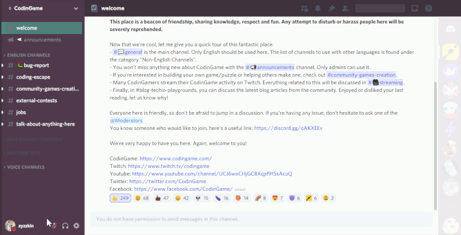

# Aubergine Classic for Discord Web

The purpose of this project is to let people relive now in Discord the comfy times they had on Slack with the Aubergine theme back in the days.

The user css from this repo is supposed to be used with the light theme and the dark sidebar option turned on.
## Preview

## Installation

The way you apply user css changes over time. Your browser could support it directly, but then this feature could get removed in the next version. Currently you can rely on extensions.
- User CSS for [Chrome](https://www.google.com/search?q=user+css+chrome).
- User CSS for [Firefox](https://www.google.com/search?q=user+css+firefox).
- General information about [user CSS](https://www.google.com/search?q=user+css).

## Notes

- To achieve a Slack-y look, this theme alters the UI of Discord slightly. Do not panic, changes are cosmetic and can be easily reverted. Refer to the links in [the previous section](#Installation) if you don't know how to turn the theme off.
- Extensions even from official sources for your browser can be compromised. You might want to avoid extensions with a questionable rating.
- Try and comprehend the code you paste into browser extensions. Pasting the wrong stuff might give attackers access to your Discord Account.

## Work in progress

- Remove leftover shadow on the selected element of the channel list.
- Reset opacity of the server banner on hover, using only CSS. Currently opacity is left at 0.1 by default.
- Improve Slackiness of the channel view
  - Uncollapse by default the message actions menu 
  - Style the input field 

## Licence
0BSD
